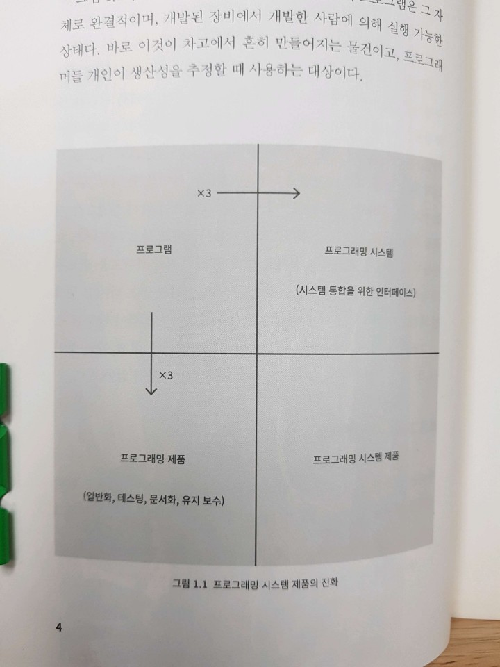

# 맨먼스 미신

## 초판 서문

- 전문적인 프로그래머, 전문적인 관리자, 특히 프로그래머를 관리하는 전문 관리자들을 염두에 둔 것

- 핵심적인 논지는
  - 대규모 프로그래밍 프로젝트는 업무 분배 때문에 소규모 프로젝트와 성격을 달리하는 관리적 문제를 겪게 되며
  - 제품 자체의 개념적 일관성을 유지하는 일이 결정적으로 필요하다.

## 1장 타르 구덩이

- 프로그램이 가로선으로 표시된 경계를 넘어서 아래로 가면 프로그래밍 제품이 된다.
  - 보편적으로 쓸모있는 프로그래밍 제품이 되려면 일반화된 방식으로 작성되어야 한다.
  - 철저한 테스트
  - 문서화

- 프로그램이 세로선으로 표시된 경게를 넘어가면 프로그래밍 시스템의 구성요소가 된다.
  - 상호 작용 고려

- 프로그램이 대각선 아래에는 프로그래밍 시스템 제품이 위치한다.
  - 전체 비용은 아홉 배

## 2장 맨먼스 미신

- 부족한 시간 탓에 망가진 프로젝트의 원인
  - 1 부족한 추정 능력
  - 2 추정을 하면서 투입 공수와 작업 진척도를 혼동하는 오류를 범하여, 인원과 기간이 상호 교환 가능하다고 자기도 모르게 가정하게 된다.
  - 3 자기가 내린 추정에 대해 스스로도 확신이 들지 않음 -> 확신 부족
  - 4 일정 진척도가 제대로 모니터링 되지 않는다.
  - 5 일정이 어긋나는 것을 감지했을 때의 자연스러운 대응이 인력 추가 투입

- 부족한 시간 탓에 망가진 프로젝트의 원인
  - 낙관주의
  - 맨먼스
  - 시스템 테스트
  - 소심한 추정
  - 일정 붕괴의 악순환

- 시스템 테스트
  - 브룩스 교수의 대략적인 소프트웨어 프로젝트 일정
    - 계획 수립: 1/3
    - 코팅: 1/6
    - 구성 요소 테스트와 초기 시스템 테스트: 1/4
    - 모든 구성 요소가 준비된 후의 시스템 테스트: 1/4
  - 계획 수립에 지나치게 많은 시간이 포함된 것 같지만 상세하고 탄탄한 명세를 만들기에 빠듯하다.
  - 최신 기술에 대한 연구나 조사 활동까지 포함하기에 충분치 않을 수도 있다.
  - 일정의 절반을 테스트에 배정한 경우는 거의 없었지만 대부분 나중에는 그만큼의 시간을 결국 테스트에 쓴다.
  - 이런 프로젝트들의 상당수가 시스템 테스트 전까지는 원래 일정대로 진행되고 있었다.

## 3장 외과 수술 팀

- 작고 예리한 팀이라는 개념이 가진 문제점은, 정말로 큰 시스템을 만드는 데 너무 오랜 시간이 걸린다는 점이다.

- 외과 수술 팀
  - 요즘에도 이런 구성으로 팀을 만들어야 할까?
  - 일부는 필요하고 일부는 불필요할 것 같다.
  - 모든 사람이 비슷한 역할을 해야하는가? 특정 인원이 특정 역할을 해야하는가?

- 외과의
  - 수석 프로그래머
  - 기능과 성능 명세를 정의, 프로그램을 설계, 코딩, 테스트, 문서 작성
  - 재능 경력 등이 요구됨

- 부조종사
  - 외과의의 분신
  - 경험이 많지 않다.
  - 외과의와 함께 아이디어를 시도해 볼 수 있지만, 부조종사의 의견에 구애받지 않는다.
  - 코드를 작성할 수 있지만 책임까지 지지는 않는다.

- 행정담당
  - 돈, 사람, 공간, 장비를 관장
  - 다른 부서의 행정 파트와 소통

- 편집자
  - 문서 생산은 외과의에게 책임이 있고, 최대한 명확성을 기하기 위해 문서는 외과의가 직접 작성해야 한다.
  - 문서의 비평, 재작업, 버전관리 등은 편집자가 담당

- 도구담당
  - 기본 서비스들이 팀에 적합한지를 확인
  - 팀에 필요한 특수 도구들을 구축-유지-업그레이드

- 테스터
  - 기능 명세를 이용하여 시스템 테스트 케이스를 작성
  - 테스트를 계획하고 구성 요소 테스트를 위해 scaffolding을 짜기도 한다.

- 언어 전문가
  - 프로그래밍 언어의 복잡함을 마스터하는데서 즐거움을 얻는 이들
  - 자문 역할
  - 어렵고 모호하거나 까다로운 일을 처리하기 위해 특정 언어를 깔끔하고 효율적으로 사용하는 방법을 찾아낸다.

## 4장 귀족 정치, 민주주의, 시스템 설계

- 개념적 일관성
  - 프로그래밍 시스템에서 개념적 불일치가 발견되는 것은 여러 명이 설계 작업을 나눈 경우에 생긴다.

- 시스템의 개념적 일관성이 사용의 용이성을 결정한다.

- 귀족 정치에 관한 질문에는 답이 예와 아니오 둘 다여야 한다.
  - 예라는 것은 아키텍트는 소수여야만 하면 그들이 빚어낸 결과물은 구현자들의 것보다 더 오래 지속되어야 하기 때문이다.
  - 시스템이 개념적 일관성을 가져야 한다면 누군가가 그 개념을 통제해야만 한다.
  - 아니오 라는 것은 외부적인 명세를 기술하는 것이 구현 방안을 설계하는 것보다 더 창조적이지는 않다는 점 때문이다.
  - 단지 또 다른 창조적 업무일 뿐이다.
  - 외부로부터 아키텍처가 주어진다는 사실이 구현 담당 그룹의 창조성을 저해하는 것이 아니라 더 높인다고 생각한다.

## 5장 두 번째 시스템 효과

- 아키텍트가 주의할 것
  - 구현 과정에처 창의성을 발휘할 책임은 구현자에게 있음을 기억하고 지시가 아닌 제안을 하도록 한다.
  - 명세하는 모든 것에 대해 적어도 한 가지 구현 방법은 제시할 수 있도록 항상 준비하고, 목적을 똑같이 만족하는 다른 방안도 수용할 수 있어야 한다.
  - 이런 제안은 조용히 개인적으로 이야기한다.
  - 개선안을 제시한 공을 인정받는 데 미련을 두지 말아야 한다.

- 두 번째 시스템 효과
  - 두 번째 것은 한 사람이 설계할 수 있는 것 중 가장 위험한 시스템이다.

## 6장 말을 전하다

- 메뉴얼은 제품에 대한 외부적인 명세로 사용자가 보게 되는 모든 세부 사항을 기술하고 규정한다.
- 이것은 아키텍트의 가장 주요한 산출물이다.
- 사용자와 구현자들로부터 계속 피드백을 얻어가면서 순환적으로 진행된다.
- 메뉴얼은 인터페이스를 비롯해서 사용자가 보는 모든 것을 기술해야 하며, 사용자가 보지 않는 부분은 기술하기를 자제해야 한다.
- 그 부분은 구현자의 소관이며, 설계의 자유를 그 안에서 마음껏 펼칠 수 있어야 한다.
- 아키텍트는 자신이 기술하는 모든 기능에 대해 구현 방안 한 가지는 제시할 수 있도록 항상 준비해야 하지만, 실제 구현이 이루어지는 방안을 지시하려고 해서는 안 된다.

- 형식적 정의
  - 이게 뭘까?

## 7장 바벨탑은 왜 실패했는가

- 프로젝트 워크북
  - 프로젝트 워크북은 별개의 문서라기보다는 프로젝트를 진행하면서 생산될 문서들로 구성한 하나의 체계다.
  - 프로젝트의 모든 문서는 이 체계의 일부분이 되어야 한다.
  - 프로젝트 목표, 외부 명세, 인터페이스 명세, 기술 표준, 내부 명세, 관리 메모 등
  - 문서 산출물의 구조를 잡을 수 있다.
  - 필요한 사람 모두에게 관련 정보를 전달할 수 있다.

## 8장 예고 홈런

- 프로그래밍 작업에는 시간이 얼마나 필요할까?
  - 코딩 부분만을 추정한 다음에 비율을 역산해서 전체 작업량을 추정해서는 안 된다.

## 9장 5파운드 자루에 담은 10파운드

## 10장 기록물 가설

- 문서를 하나씩 준비하는 과정은 생각을 집중하고 무한정 떠돌 수도 있는 논의를 명확히 정리하는 중요한 기회가 되기도 한다.
- 문서의 유지 관리는 감독과 경고 체계의 기능을 하며 문서 자체는 체크리스트, 상황 통제 수단, 보고를 위한 데이터베이스 역할을 한다.

- 필요한 문서들
  - 목표
    - 요구사항, 최종목표, 필요한 것, 제약 조건, 우선순위 등을 기록
  - 명세
    - 메뉴얼, 성능 명세
    - 가장 먼저 작성하는 문서이며 가장 마지막에 마무리되는 문서
  - 일정
  - 예산
    - 예산은 제약, 제약에 의해 기술적 결정을 하게 된다.

- 소프트웨어 프로젝트의 문서들
  - 목표
  - 제품 명세
    - 제안서로 시작해서 메뉴얼 및 내부 문서화로 끝난다.
    - 속도와 공간의 명세가 핵심이다.
  - 일정
  - 예산
  - 공간 할당
    - 메모리 등을 의미하는 듯
  - 조직도
    - 콘웨이의 법칙
      - 시스템을 설계하는 조직은, 그 조직의 의사소통 구조를 본뜬 시스템을 만들어내게 되어 있다.
      - 최초의 조직도에는 첫 설계 내용이 반영된다.
      - 이 설계가 제대로일 가능성은 아주 낮다.
      - 시스템 설계가 자유롭게 변경될 수 있어야 한다면 조직 역시 변화에 대비하고 있어야 한다.

- 왜 형식을 갖춘 문서를 만드는가
  - 글로 적을 때문 빠진 곳이 나타나고 모순들이 드러난다.
  - 결정된 내용을 문서를 통해 다른 이들에게 알릴 수 있다.

## 11장 버리기 위한 계획

- 화학 분야 엔지니어들은 실험실에서 동작하던 공정이라 해서 곧바로 공장에서 돌아가지 않는다는 것을 오래전에 배웠다.
- 보호되지 않은 환경에서 대량으로 공정을 가동하는 경험을 쌓으려면 파일럿 공장이라는 중간 단계를 거쳐야 한다.
- 대부분의 프로젝트에서 나온 첫 시스템은 거의 쓸 수 없는 수준이다.
- 너무 느리거나 너무 크거나 쓰기에 불편하다.
- 우리가 해야 할 질문은 파일럿 시스템을 만든 다음에 버릴 것이냐 말 것이냐가 아니다.
- 유일하게 할 수 있는 질문은 버릴 시스템을 만들기 위해 미리 계획을 세울 것인가, 아니면 그것을 고객에게 납품하겠다고 약속할 것인가이다.
- 버리기 위한 계획을 세우라. 어쨌거나 버리게 될 것이다.

- 프로그램이 만들어지고 테스트되고 사용되는 과정에서 사용자의 실제 욕구와 그에 대한 인식도 변해 갈 것이다.
- 목표가 얼마간 변경되는 것은 피할 수 없기에, 그런 일이 일어나지 않을 거라 가정하기 보다는 사전에 대비해 두는 편이 낫다.

- 변경 사항을 일정한 묶음으로 처리하는 것은 필수적인 기법이다.
- 모든 제품은 버전이 매겨져야 하며, 각 버전은 고유 일정과 코드 프리즈 날짜를 갖고 있어야 한다.
- 프리즈 이후에 들어오는 변경 사항은 다음 버전으로 이월된다.

- 프로그램 유지 보수는 설계 결함을 수정하는 변경이 대부분이다.
- 널리 쓰이는 프로그램을 유지 보수하는 비용은 통상 개발 비용은 40% 이상이다.
- 프로그램 유지 보수의 근본적인 문제는 결함을 수정할 때 상당환 (20~50%) 확률로 또 다른 결함이 유입된다는 것이다.
- 그러므로 전체 과정은 두 걸음 전진 후에 한 걸음 후되가 된다.

- 모든 수정행위는 시스템 구조를 훼손하고 엔트로피와 무질서를 증가시키는 경향을 보였다.
- 프로그램이 만들어졌을 때는 본질적으로 준안정적인 상태다.
- 프로그램 유지보수는 엔트로피를 증가시키는 과정이고, 아무리 능숙하게 수행된다 해도 시스템이 수리불가의 구닥다리가 되는 것을 잠시 늦출 수 있을 뿐이다.

## 12장 예리한 도구