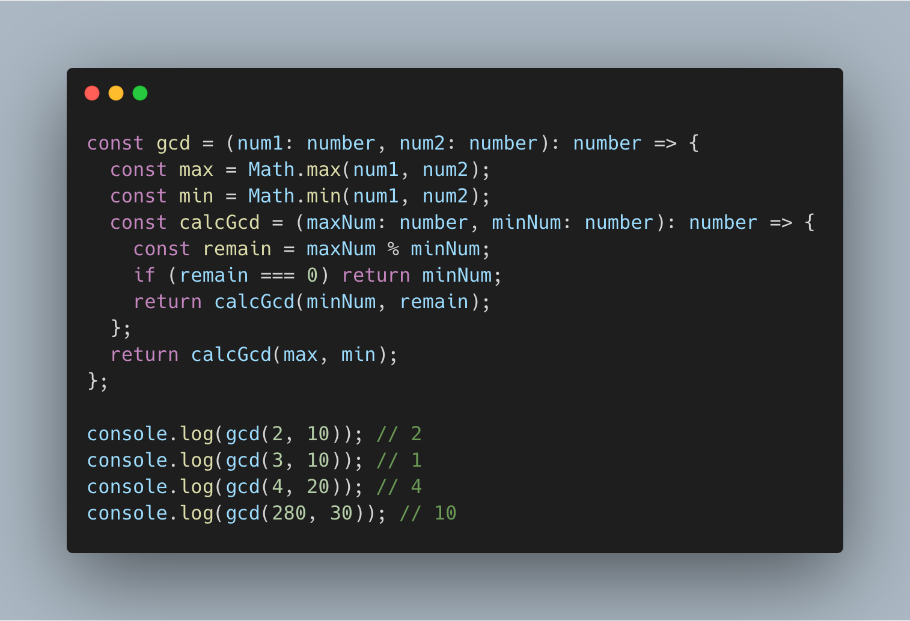

# float

```html
<!DOCTYPE html>
<html lang="en">
<head>
  <meta charset="UTF-8">
  <meta name="viewport" content="width=device-width, initial-scale=1.0">
  <title>Document</title>
  <style>
    img {
      width: 300px;
      float: left;
      margin-right: 20px;
      margin-bottom: 10px;
    }
  </style>
</head>
<body>
  
  <p>Lorem ipsum dolor sit amet, consectetur adipisicing elit. Reiciendis
    veniam totam labore ipsum, nesciunt temporibus repudiandae facilis
    earum, sunt autem illum quam dolore, quae optio nemo vero quidem animi
    tempore aliquam voluptas assumenda ipsa voluptates. Illum facere dolor
    eos, corporis nobis, accusamus velit, similique cum iste unde vero
    harum voluptatem molestias excepturi. Laborum beatae, aliquid aliquam
    excepturi pariatur soluta asperiores laudantium iste, architecto
    ducimus fugiat sed, saepe quaerat recusandae exercitationem sapiente,
    impedit nostrum error. Doloremque impedit, eos in quos assumenda illo
    eum dicta. Voluptatum quaerat excepturi consectetur, doloremque esse
    deleniti commodi natus, maxime sit?</p>
</body>
</html>
```

img가 떠 있는 것 같고 나머지 text는 img 외곽을 따라 출력된다.

img를 float라고 설정하면 img가 존재하는 위치에 등장하는 모든 엘리먼트는 영향을 받는다. 이 영향을 받지 않도록 설정하려면 clear: both를 추가한다.

```html
<!DOCTYPE html>
<html lang="en">
  <head>
    <meta charset="UTF-8" />
    <meta name="viewport" content="width=device-width, initial-scale=1.0" />
    <title>Document</title>
    <style>
      img {
        width: 300px;
        float: left;
        margin-right: 20px;
        margin-bottom: 10px;
      }
    </style>
  </head>
  <body>
    
    <p>
      Lorem ipsum dolor sit amet, consectetur adipisicing elit. Reiciendis
      veniam totam labore ipsum, nesciunt temporibus repudiandae facilis earum,
      sunt autem illum quam dolore, quae optio nemo vero quidem animi tempore
      aliquam voluptas assumenda ipsa voluptates. Illum facere dolor eos,
      corporis nobis, accusamus velit, similique cum iste unde vero harum
      voluptatem molestias excepturi. Laborum beatae, aliquid aliquam excepturi
      pariatur soluta asperiores laudantium iste, architecto ducimus fugiat sed,
      saepe quaerat recusandae exercitationem sapiente, impedit nostrum error.
      Doloremque impedit, eos in quos assumenda illo eum dicta. Voluptatum
      quaerat excepturi consectetur, doloremque esse deleniti commodi natus,
      maxime sit?
    </p>
    <p style="clear:both">
      Lorem ipsum dolor sit amet, consectetur adipisicing elit. Reiciendis
      veniam totam labore ipsum, nesciunt temporibus repudiandae facilis earum,
      sunt autem illum quam dolore, quae optio nemo vero quidem animi tempore
      aliquam voluptas assumenda ipsa voluptates. Illum facere dolor eos,
      corporis nobis, accusamus velit, similique cum iste unde vero harum
      voluptatem molestias excepturi. Laborum beatae, aliquid aliquam excepturi
      pariatur soluta asperiores laudantium iste, architecto ducimus fugiat sed,
      saepe quaerat recusandae exercitationem sapiente, impedit nostrum error.
      Doloremque impedit, eos in quos assumenda illo eum dicta. Voluptatum
      quaerat excepturi consectetur, doloremque esse deleniti commodi natus,
      maxime sit?
    </p>
  </body>
</html>
```

clear=both, left, right 중에서 선택할 수 있다.
